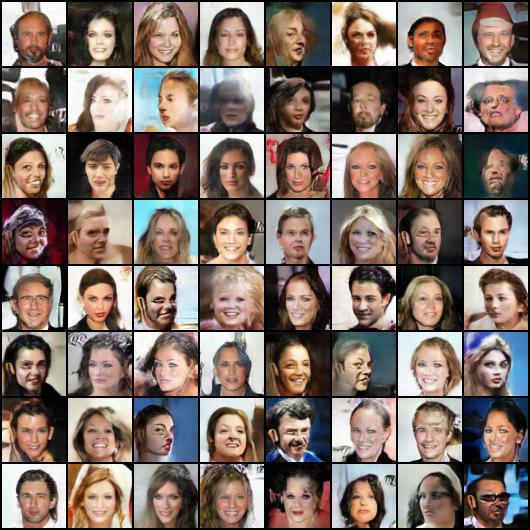

# DCGAN with pytorch

The goal of this project is to completely re-implement original DCGAN and to replicate some of experiments presented in [_**Unsupervised Representation Learning With Deep Convolutional Generative Adversarial Networks**_](https://arxiv.org/abs/1511.06434)


### How to run

To train model from scratch, use following command.

```
python main.py --dataset [CelebA, LSUN, STL10]
```

To train model following existing checkpoint, use following command.

```
python main.py --dataset [CelebA, LSUN, STL10] --model_path MODEL_PATH
```


To generate new images using the trained model, use following command. (image_save_path is optional)

```
python main.py --test --model_path MODEL_PATH (--image_save_path IMAGE_SAVE_PATH)
```


## Results

----------------------------------------------------------

### CelebA (soft, stochastic label: real=0.9-1, fake=0-0.1)

* Images generated using fixed noise


* New images generated with random z




As you can see, some generated images are really good, while others are not good enough, and some are somewhat weird and scary

* Transition from one generated image to another

Following images show transition from leftmost image to rightmost image. Nine images in middle are generated using linear combinations of two latent vectors that were used to generate leftmost and rightmost images.

![transition 1](./images/CelebA-soft-label/image_transition_1.jpg]

![transition 2](./images/CelebA-soft-label/image_transition_2.jpg]

![transition 3](./images/CelebA-soft-label/image_transition_3.jpg]


### Other data sets under training...
